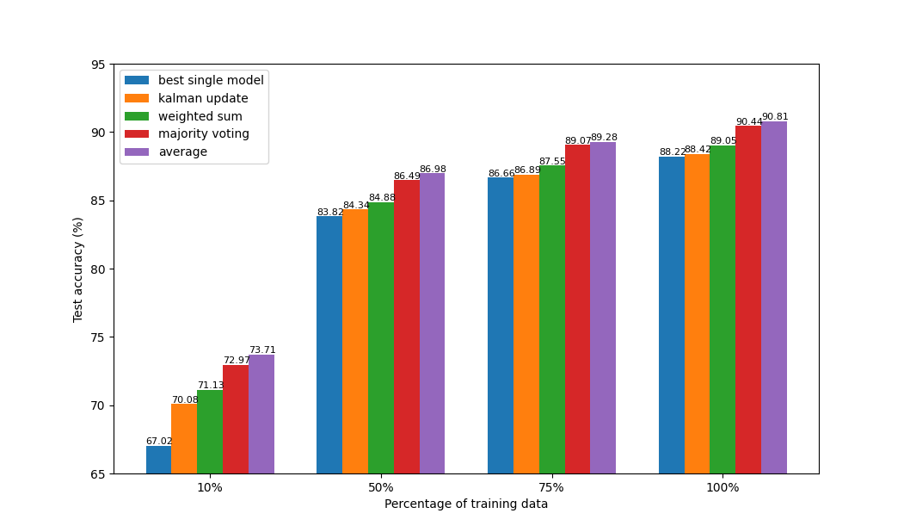
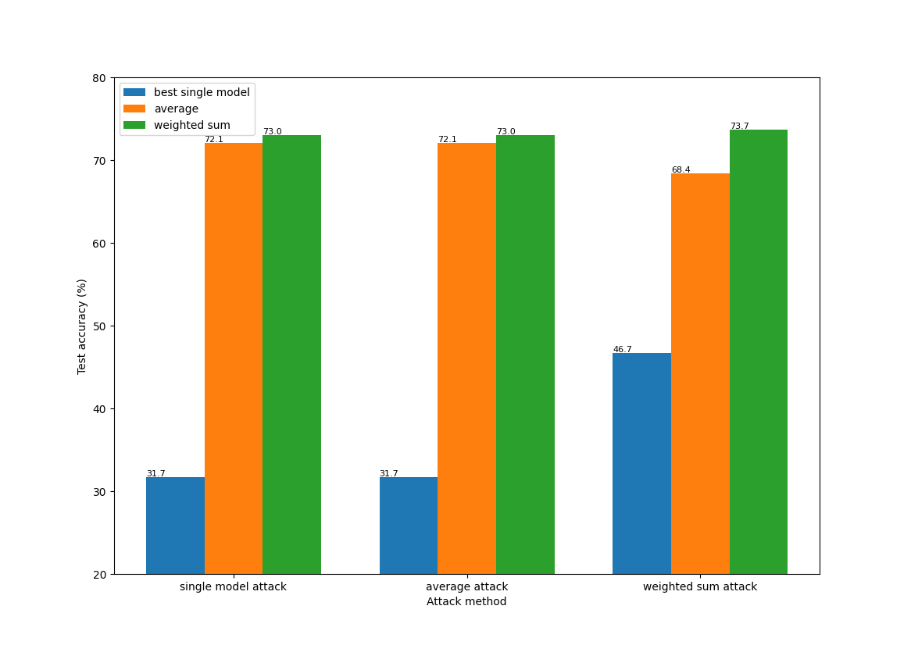

# csNet
A neural network framework try to fuse different models to make better predictions

An example of testing performance on CIFAR10 are shown below

## Generalization Performance

## Robustness

# Usage:

## To train the networks

python script/train.py

## To test the results:

python script/eval.py

## Config
The config files for both training and validation are in config/configs.yaml